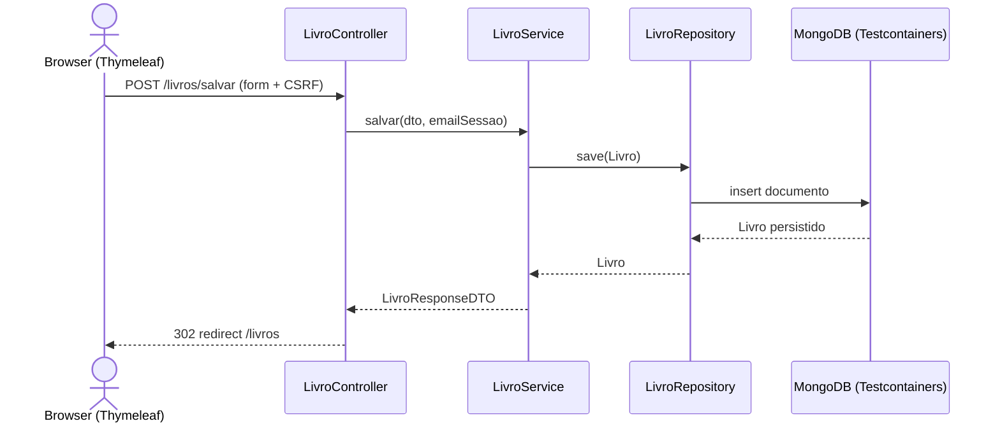
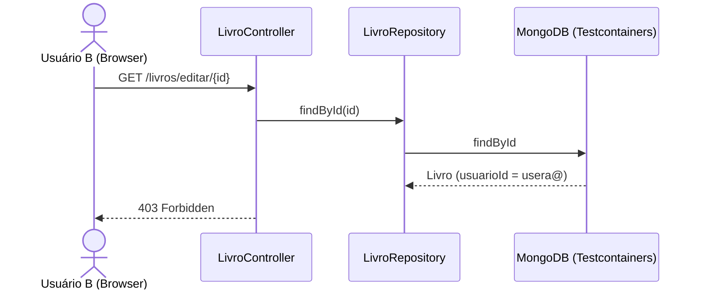
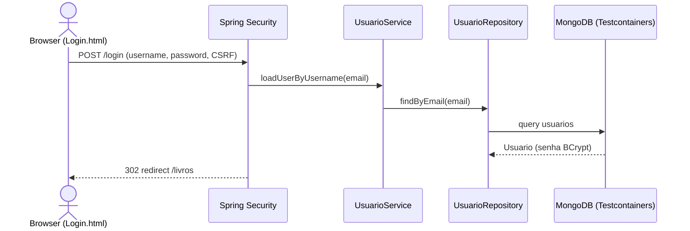
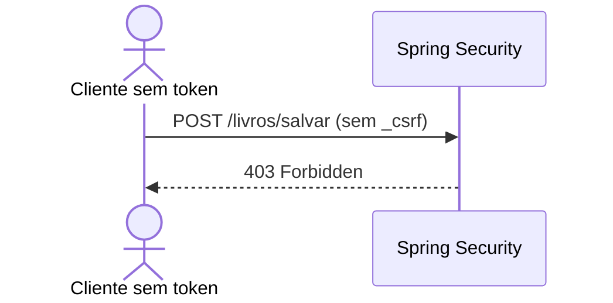
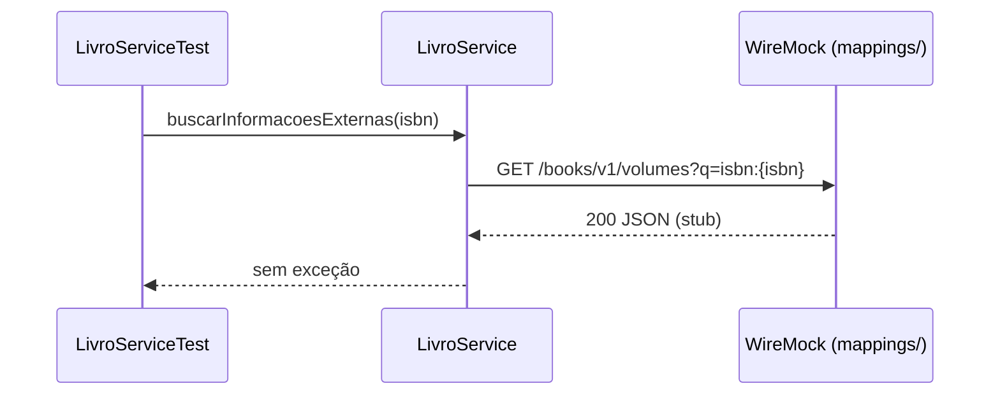
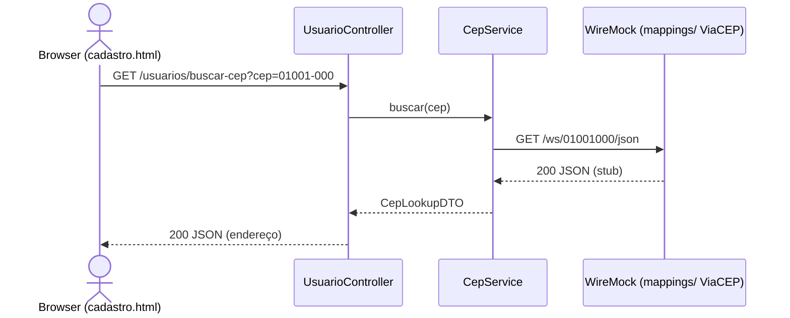

# RTM — Matriz de Rastreabilidade de Requisitos

Mapeamento dos requisitos funcionais aos testes automatizados (sem mocks de persistência ou APIs externas).

| ID | Requisito | Classe de produção | Classe de teste | Método de teste |
|----|-----------|-------------------|-----------------|-----------------|
| REQ-001 | CRUD de livros (controller) | `LivroController` | `LivroControllerTest` | `deveExibirListaDeLivros`, `deveExibirTelaDeNovoLivro`, `deveSalvarNovoLivroERedirecionar`, `deveExcluirLivroERedirecionar`, `deveBuscarIsbnViaApi` |
| REQ-001 | CRUD de livros (serviço) | `LivroService` | `LivroServiceTest` | `deveSalvarLivroComSucesso`, `deveListarPorUsuario`, `deveListarTodosOsLivros`, `deveBuscarPorIsbnComSucesso_UsandoWireMock`, `deveBuscarPorIsbnSemResultado` |
| REQ-002 | Autenticação (login sucesso/falha) | `SecurityConfig`, `UsuarioService` | `LoginSecurityIT` | `deveAutenticarUsuarioComCredenciaisCorretas`, `deveFalharLoginComCredenciaisInvalidas` |
| REQ-002 | Cadastro de usuário (front + controller) | `UsuarioController` | `UsuarioControllerE2EIT` | `deveCadastrarUsuarioViaFormulario` |
| REQ-002 | Cadastro e criptografia (serviço) | `UsuarioService` | `UsuarioServiceIntegrationIT` | Testes de `UsuarioServiceIntegrationIT` |
| REQ-002 | Proteção CSRF (cadastro e livros) | `SecurityConfig` | `LoginSecurityIT`, `LivroControllerTest` | `deveBloquearPostSemCsrf` (Login/usuarios), `deveBloquearPostSemCsrf`, `deveAceitarPostComCsrfValido` (livros) |
| REQ-002 | Isolamento de dados entre usuários | `LivroController`, `LivroService` | `LoginSecurityIT`, `LivroServiceTest` | `usuarioBNaoPodeEditarLivroDoUsuarioA`, `usuarioBNaoPodeExcluirLivroDoUsuarioA`, `listagemIsolaDadosPorUsuario` |
| REQ-003 | Integração Google Books (busca por ISBN) | `LivroService` | `LivroServiceTest` | `deveBuscarPorIsbnComSucesso_UsandoWireMock`, `deveBuscarPorIsbnSemResultado` |
| REQ-004 | Integração ViaCEP / Busca de CEP (preenchimento de endereço no cadastro) | `CepService`, `UsuarioController` | `CepServiceTest` | `deveBuscarCepComSucesso_UsandoWireMock`, `deveRetornarVazioParaCepInvalido` |

---

## REQ-001: CRUD de Livros

### Diagrama de sequência — Cadastrar livro



### Diagrama de sequência — Isolamento na edição



---

## REQ-002: Autenticação e Segurança

### Diagrama de sequência — Login com sucesso



### Diagrama de sequência — Bloqueio CSRF



---

## REQ-003: Integração Google Books

### Diagrama de sequência — Busca por ISBN (WireMock)



---

## REQ-004: Integração ViaCEP (Busca de CEP)

### Descrição
Recurso para obter dados de endereço a partir do CEP durante o fluxo de cadastro de usuário. Implementado com `CepService` que consome a API ViaCEP; em testes de integração usamos WireMock (configurado em AbstractIntegrationTest).

### Diagrama de sequência — Busca de CEP (WireMock)



---

## Estrutura de testes (após limpeza)

```
src/test/java/com/example/biblioteca/
├── AbstractIntegrationTest.java
├── TestcontainersConfiguration.java
├── BibliotecaApplicationTests.java
├── controller/
│   ├── LivroControllerTest.java
│   ├── LoginSecurityIT.java
│   └── UsuarioControllerE2EIT.java
└── service/
    ├── CepServiceTest.java
    ├── LivroServiceTest.java
    └── UsuarioServiceIntegrationIT.java
```
