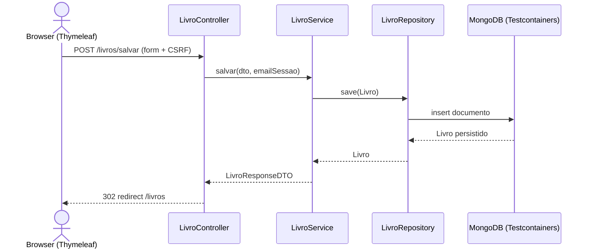
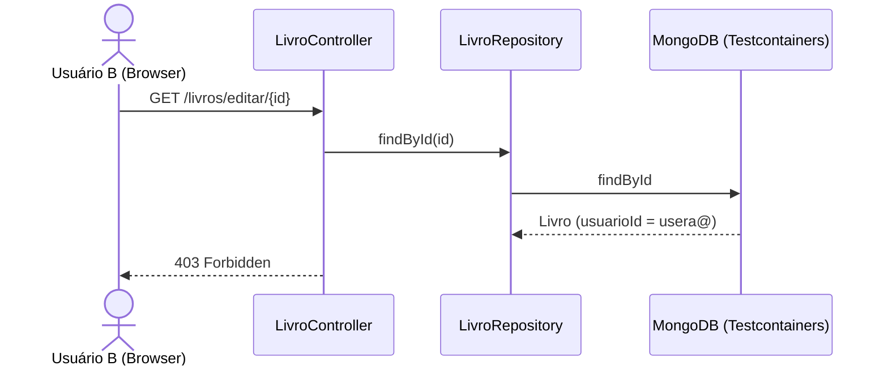
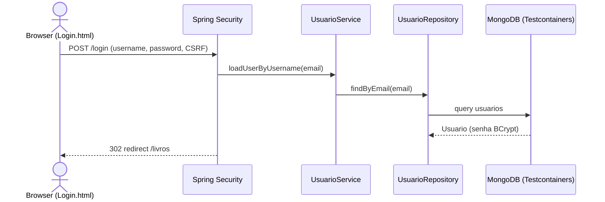
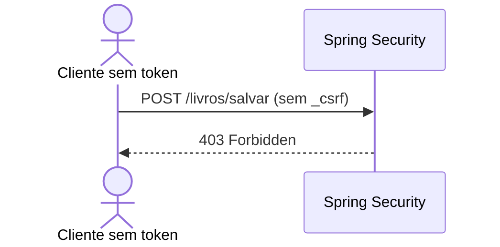
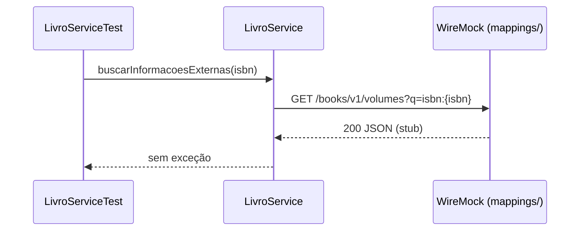

# RTM — Matriz de Rastreabilidade de Requisitos

Mapeamento dos requisitos funcionais aos testes automatizados (sem mocks de persistência ou APIs externas).

| ID | Requisito | Classe de produção | Classe de teste | Método de teste |
|----|-----------|-------------------|-----------------|-----------------|
| REQ-001 | CRUD de livros (controller) | `LivroController` | `LivroControllerTest` | `deveExibirListaDeLivros`, `deveExibirTelaDeNovoLivro`, `deveSalvarNovoLivroERedirecionar`, `deveExibirTelaDeEdicaoSeLivroExistir`, `deveAtualizarLivroERedirecionar`, `deveExcluirLivroERedirecionar` |
| REQ-001 | CRUD de livros (serviço) | `LivroService` | `LivroServiceTest` | `deveSalvarLivroComSucesso`, `deveListarPorUsuario`, `deveListarTodosOsLivros`, `usuariosNaoDevemVerLivrosUnsDosOutros` |
| REQ-002 | Autenticação (login sucesso/falha) | `SecurityConfig`, `UsuarioService` | `LoginSecurityIT` | `deveAutenticarUsuarioComCredenciaisCorretas`, `deveFalharLoginComCredenciaisInvalidas` |
| REQ-002 | Cadastro de usuário | `UsuarioController` | `UsuarioControllerE2EIT` | `deveCadastrarUsuarioViaFormulario` |
| REQ-002 | Cadastro e criptografia (serviço) | `UsuarioService` | `UsuarioServiceIntegrationIT` | Testes de `UsuarioServiceIntegrationIT` |
| REQ-002 | Proteção CSRF (cadastro) | `SecurityConfig` | `LoginSecurityIT` | `deveBloquearPostSemCsrf` |
| REQ-002 | Proteção CSRF (livros) | `SecurityConfig` | `LivroControllerTest` | `deveBloquearPostSemCsrf`, `deveAceitarPostComCsrfValido` |
| REQ-002 | Isolamento de dados entre usuários | `LivroController` | `LoginSecurityIT` | `usuarioBNaoPodeEditarLivroDoUsuarioA`, `usuarioBNaoPodeExcluirLivroDoUsuarioA`, `listagemIsolaDadosPorUsuario` |
| REQ-003 | Integração Google Books | `LivroService` | `LivroServiceTest` | `deveBuscarInformacoesExternasComSucesso_UsandoWireMock`, `deveBuscarInformacoesExternasSemResultado` |

---

## REQ-001: CRUD de Livros

### Diagrama de sequência — Cadastrar livro



### Diagrama de sequência — Isolamento na edição



---

## REQ-002: Autenticação e Segurança

### Diagrama de sequência — Login com sucesso



### Diagrama de sequência — Bloqueio CSRF



---

## REQ-003: Integração Google Books

### Diagrama de sequência — Busca por ISBN (WireMock)



---

## Estrutura de testes (após limpeza)

```
src/test/java/com/example/biblioteca/
├── AbstractIntegrationTest.java
├── TestcontainersConfiguration.java
├── BibliotecaApplicationTests.java
├── controller/
│   ├── LivroControllerTest.java
│   ├── LoginSecurityIT.java
│   └── UsuarioControllerE2EIT.java
└── service/
    ├── LivroServiceTest.java
    └── UsuarioServiceIntegrationIT.java
```
